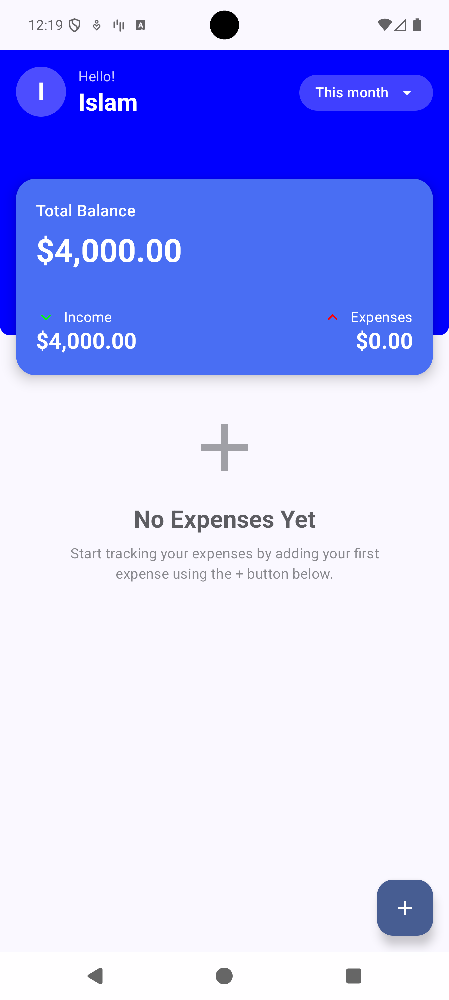
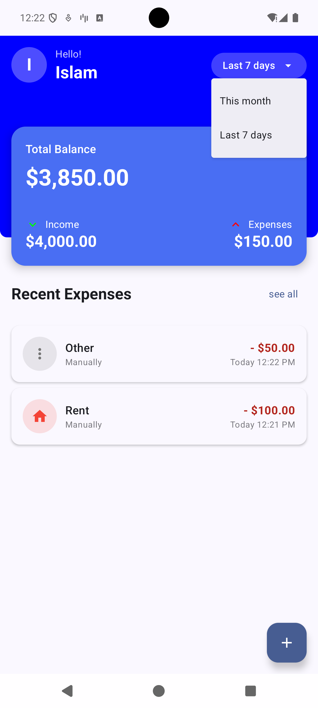
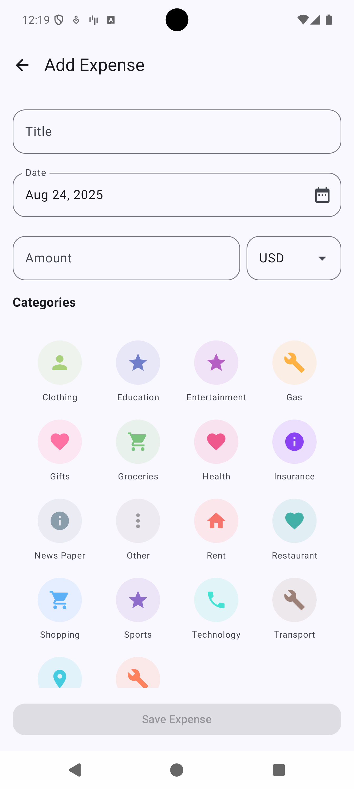
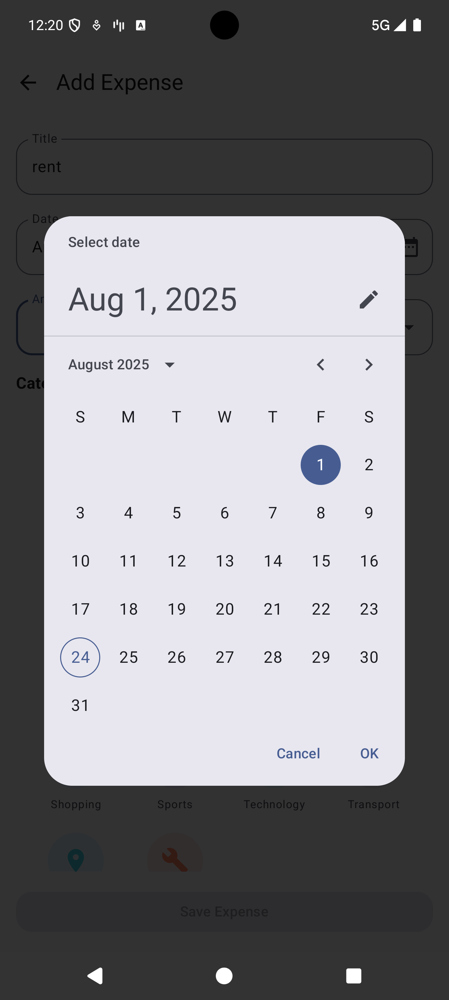
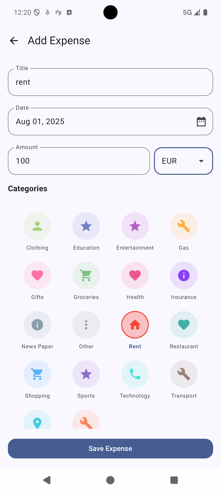
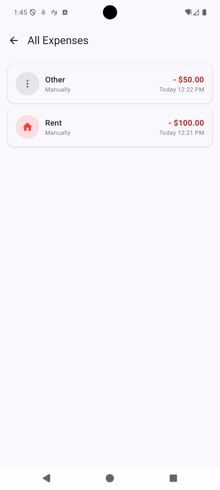

# Expense Tracking App

A modern Android expense tracking application built with Jetpack Compose, following Clean Architecture principles and MVVM pattern.

## Project Overview

This expense tracking app allows users to manage their personal finances by tracking expenses across different categories with multi-currency support. The app provides a clean, intuitive interface for adding expenses, viewing financial summaries, and monitoring spending patterns.

### Key Features
- **Multi-currency expense tracking** with real-time exchange rates
- **Category-based expense organization** with predefined icons and colors
- **Dashboard with financial overview** (balance, income, expenses)
- **Pagination support** for large expense lists
- **Date filtering** (this month, last 7 days)
- **Offline-first architecture** with local database storage
- **Modern Material Design 3 UI** with Jetpack Compose

## Architecture Breakdown

### Clean Architecture Layers

The app follows Clean Architecture principles with clear separation of concerns:

```
├── presentation/          # UI Layer (Compose, ViewModels, UI States)
├── domain/               # Business Logic Layer (Use Cases, Models)
└── data/                # Data Layer (Repositories, DAOs, API)
```

### MVVM + MVI Pattern

- **Model**: Domain models and data entities
- **View**: Jetpack Compose UI components
- **ViewModel**: State management with `StateFlow` and `SharedFlow`
- **MVI Elements**: Unidirectional data flow with UI events and side effects

### Key Architectural Components

#### Dependency Injection
- **Hilt** for dependency injection across all layers


#### State Management
```kotlin
// UI State Pattern
data class DashboardUiState(
    val balance: Balance? = null,
    val recentExpenses: List<Expense> = emptyList(),
    val isLoading: Boolean = false,
    val errorMessage: String? = null
)

// UI Events
sealed class DashboardUiEvent {
    object LoadData : DashboardUiEvent()
    data class FilterChanged(val filter: TimeFilter) : DashboardUiEvent()
}

// Side Effects
sealed class DashboardSideEffect {
    object NavigateToAllExpenses : DashboardSideEffect()
    object NavigateToAddExpense : DashboardSideEffect()
}
```

#### Database Layer
- **Room** for local data persistence
- **Embedded objects** for complex data types (Amount, Category)
- **Type converters** for Date and enum serialization
- **Foreign key relationships** between expenses and categories

#### Repository Pattern
```kotlin
interface ExpenseRepository {
    suspend fun insertExpense(expense: Expense): Long
    fun getAllExpensesPaged(): Flow<PagingData<Expense>>
    suspend fun getExpensesForDateRange(startDate: Date, endDate: Date): List<Expense>
}
```

## API Integration Notes

### Exchange Rate API
- **Provider**: Fixer.io API for real-time currency exchange rates
- **Base Currency**: USD (United States Dollar)
- **Supported Currencies**: 170+ international currencies
- **Caching Strategy**: Exchange rates cached in ViewModel for session duration
- **Fallback**: Hardcoded rates for common currencies when API is unavailable

## Pagination Strategy

### Local Pagination with Room + Paging 3

The app implements **local pagination** using Room database as the single source of truth:

```kotlin
@Query("SELECT * FROM expenses ORDER BY date DESC")
fun getAllExpensesPaged(): PagingSource<Int, ExpenseEntity>

// Repository Implementation
override fun getAllExpensesPaged(): Flow<PagingData<Expense>> {
    return Pager(
        config = PagingConfig(
            pageSize = 20,
            enablePlaceholders = false
        ),
        pagingSourceFactory = { expenseDao.getAllExpensesPaged() }
    ).flow.map { pagingData ->
        pagingData.map { it.toDomain() }
    }
}
```

### Pagination Benefits
- **Memory Efficient**: Only loads visible items plus buffer
- **Smooth Scrolling**: Automatic loading of additional pages
- **Database Optimized**: Leverages SQLite's LIMIT/OFFSET for efficient queries
- **Offline Support**: Works without network connectivity

### Dashboard Strategy
- **Recent Expenses**: Loads first 10 items for dashboard preview
- **Full List**: Separate screen with full pagination support
- **Date Filtering**: Efficient queries with date range parameters

## Screenshots

### Dashboard Views
| Empty State | With Data |
|-------------|-----------|
|  |  |

### Add Expense Flow
| Initial Screen | Date Picker | Final Form |
|----------------|-------------|------------|
|  |  |  |

### All Expenses
| Expense List |
|--------------|
|  |

## Known Limitations and Assumptions

### Limitations
1. **Limited Categories**: Predefined categories only (no custom categories)
2. **No Expense Editing**: Expenses can only be added, not modified or deleted
3. **No Export Features**: No CSV/PDF export functionality

### Assumptions
1. **Monthly Income**: Static $4000 monthly income for balance calculations
2. **USD Base Currency**: All conversions calculated relative to USD
3. **Current Month Focus**: Primary use case is current month expense tracking
4. **Category Icons**: Local drawable resources for category icons
5. **Date Range**: "Last 7 days" and "This month" are the primary filtering options

### Technical Assumptions
- **Network Availability**: Internet required for initial currency rate fetch
- **Storage**: Local Room database sufficient for expense data
- **Performance**: Pagination handles up to thousands of expenses efficiently

## How to Build and Run the App

### Prerequisites
- **Android Studio**: Arctic Fox or newer
- **JDK**: Java 17 or newer
- **Android SDK**: API level 34 (Android 14)
- **Gradle**: 8.13 or newer

### Setup Instructions

1. **Clone the Repository**
   ```bash
   git clone <repository-url>
   cd ExpenseTracking
   ```

2. **Build the Project**
   ```bash
   ./gradlew assembleDebug
   ```

3. **Run Tests**
   ```bash
   ./gradlew test
   ```

4. **Code Quality Checks**
   ```bash
   ./gradlew ktlintCheck
   ```

### Development Workflow

#### Code Formatting
The project uses **ktlint** for code formatting:
```bash
# Check formatting
./gradlew ktlintCheck

# Auto-fix formatting issues
./gradlew ktlintFormat
```

#### Testing Strategy
- **Unit Tests**: Repository, Use Case, and ViewModel layers
- **Testing Frameworks**: JUnit 4, Mockito, Turbine for Flow testing
- **Test Coverage**: Focus on business logic and data layer

#### CI/CD
GitHub Actions workflow automatically:
- Runs ktlint checks
- Builds debug APK
- Uploads build artifacts

### Project Structure
```
app/src/main/java/uk/co/invola/expensetracking/
├── data/
│   ├── local/          # Room database, DAOs, entities
│   ├── remote/         # Retrofit API interfaces
│   ├── repository/     # Repository implementations
│   └── mapper/         # Data mapping functions
├── domain/
│   ├── model/          # Domain models
│   ├── repository/     # Repository interfaces
│   └── usecase/        # Business logic use cases
├── presentation/
│   ├── dashboard/      # Dashboard screen & components
│   ├── addexpense/     # Add expense screen & components
│   ├── expenses/       # All expenses screen
│   └── composables/    # Shared UI components
└── di/                 # Dependency injection modules
```

### Gradle Dependencies
Key dependencies managed through version catalog (`gradle/libs.versions.toml`):
- **Jetpack Compose**: UI framework
- **Hilt**: Dependency injection
- **Room**: Local database
- **Retrofit**: Network client
- **Paging 3**: Pagination support
- **Kotlinx Serialization**: JSON parsing

### Running the App
1. Connect an Android device or start an emulator
2. Click "Run" in Android Studio or use:
   ```bash
   ./gradlew installDebug
   ```

The app will install and launch with the dashboard screen showing your expense overview.
